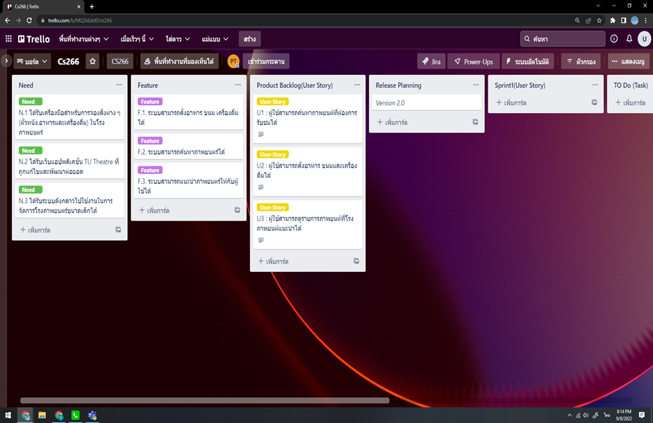

# CS266_Project
## วัตถุประสงค์ / เป้าหมายของระบบที่นักศึกษาต้องการพัฒนาต่อยอด
-	เพื่อศึกษาและทบทวนโครงงาน TU Theatre เพื่อหาจุดพัฒนาและใช้ในการพัฒนาต่อยอด
-	เพื่อออกแบบกระบวนการในการพัฒนาต่อยอดเว็บแอปพลิเคชั่น TU Theatre
-	เพื่อพัฒนาระบบค้นหาภาพยนตร์บนเว็ปแอปพลิเคชั่น
-	เพื่อพัฒนาเครื่องมือสำหรับการจองอาหารและเครื่องดื่มในโรงภาพยนตร์
-	เพื่อพัฒนาระบบแนะนำภาพยนตร์ในหน้าหลักให้กับผู้ใช้งาน
-	เพื่อพัฒนา และ แก้ไขข้อผิดพลาดของเว็บแอปพลิเคชั่น TU Theatre
## ประโยชน์ / ความคาดหวังของการนำระบบดังกล่าวไปใช้งาน
-	ช่วยให้ผู้ใช้สามารถสั่งซื้อ และเลือกจองสิ่งที่ต้องการสำหรับการรับชมภาพยนตร์ เพื่อให้ได้รับประสบการณ์การรับชม ที่ตอบโจทย์ความต้องการมากยิ่งขึ้น
-	ช่วยให้ผู้ใช้สามารถใช้งานได้อย่างลื่นไหลและมีประสิทธิภาพมากยิ่งขึ้น
-	ช่วยให้ผู้ใช้สามารถค้นหาภาพยนตร์ที่ต้องการรับชมได้ง่ายยิ่งขึ้น
-	ช่วยให้ผู้ใช้ค้นพบภาพยนตร์ที่ต้องการรับชมได้ง่ายมากยิ่งขึ้น
## รายการความต้องการ / features / function ที่ตอบวัตถุประสงค์ที่ตั้งไว้
-	สามารถค้นหาภาพยนตร์ได้
-	สามารถสั่งอาหาร ขนม เครื่องดื่มได้
-	สามารถแนะนำภาพยนตร์ให้กับผู้ใช้ได้

## sprintbacklog

- T1 : ดาวโหลด code และ set environment ให้สามารถรันตัวโปรแกรมได้ (H)(2 h)
- T2 : ออกแบบ หน้าค้นหาว่าจะทำแบบไหน แสดงผลอย่างไร (H)(5 h)
- T3 : ทำให้ช่องค้นหาสามารถใส่ชื่อภาพยนตร์ได้ (H)(1d)
- T4 : ช่องค้นหาสามารถดึงข้อมูลจาก ฐานข้อมูล ได้ (H)(1d)
- T5 : ทำให้ช่องค้นหาสามารถแสดงรายชื่อภาพยนตร์ที่มีตัวอักษรเดียวกันได้ (M)(1d)
- T6 : ทำให้ภาพยนตร์ที่ขึ้นมาในช่องค้นหามีการแสดงรูปตัวอย่างของภาพยนตร์นั้นด้วย (M)(1d) 
- T7 : สามารถคลิ๊กที่ภาพยนตร์ เพื่อไปยังหน้าจองตั๋วได้ (H)(1d)
- T8 : Test ระบบและ debug (H)(5d)
